# 書籍管理アプリ

LaravelでDDD / Clean Architectureを採用したLaravel書籍管理アプリケーション

## Live Demo
<a href="https://books-app-z5ig.onrender.com" target="_blank">https://books-app-z5ig.onrender.com</a>

**Demo Account**  
email: guest@example.com  
password: password


[](https://laravel.com/)
[](https://www.php.net/)
[]()

## Table of Contents

1. [プロジェクト概要](#1-プロジェクト概要)
2. [解決したい課題 / 開発背景](#2-解決したい課題--開発背景)
3. [技術スタック](#3-技術スタック)
4. [Architecture Highlights](#4-architecture-highlights)
5. [アーキテクチャ](#5-アーキテクチャ)
6. [UseCase 処理フロー例](#6-usecase-処理フロー例)
7. [主な機能（Features）](#7-主な機能features)
8. [スクリーンショット](#8-スクリーンショット)
9. [ER図](#9-er図)
10. [セットアップ](#10-セットアップ)
11. [今後の展望](#11-今後の展望)

---

# 1. プロジェクト概要

本プロジェクトは、Laravelを基盤としながらドメイン駆動設計（DDD）とクリーンアーキテクチャを実践することを目的としたWebアプリケーションです。

単に「動くアプリケーション」を作るのではなく、

- ビジネスロジックをフレームワークから分離する
- ドメインモデル中心の設計を実装する
- フレームワーク依存をインフラ層へ閉じ込める

といった設計原則を実際のLaravelアプリケーションでどこまで実現できるかを検証することを目的としています。

題材としてシンプルな書籍管理アプリを採用することで、機能ではなくアーキテクチャそのものに焦点を当てた実装になっています。

---

# 2. 解決したい課題 / 開発背景

## ターゲット

このプロジェクトは、次のような開発者を主な対象としています。

- Laravelを使っているがMVC以外の設計パターンを学びたい人
- DDD（ドメイン駆動設計）を実際のコードで理解したい人
- クリーンアーキテクチャをPHP / Laravelでどう実装するか知りたい人
- フレームワーク依存を減らした設計を試してみたい人
- Entity / ValueObject / UseCaseといった概念を実用コードで確認したい人

このプロジェクトはLaravel上でDDDを実践するサンプルコードとして設計されています。

---

## 解決する課題

Laravelアプリケーションは多くの場合、以下のような問題を抱えやすいです。

### 1. フレームワーク依存の肥大化

ビジネスロジックが

- Controller
- Model
- Policy
- Service

などに分散し、アプリケーションの構造が不明瞭になりがちです。

結果として

- ドメインルールの所在が分かりにくい
- テストが困難になる
- フレームワーク変更に弱くなる

といった問題が発生します。

---

### 2. MVCだけでは複雑なロジックを整理しづらい

Laravelの標準構成はMVCであり、小規模なCRUDには適しています。

しかし

- 複雑なビジネスルール
- 認可
- ユースケースの増加

が発生すると、ロジックが分散しやすくなります。

このプロジェクトでは

- UseCase
- Domain Entity
- ValueObject

を中心とした設計を採用し、ビジネスロジックを整理しています。

---

### 3. 認可ロジックの分散

一般的なLaravelアプリでは

- Controller
- Policy
- Middleware

などに認可ロジックが分散しがちです。

このプロジェクトではUseCase内で認可を実行する設計を採用しています。

```
UseCase
  ↓
Permission
  ↓
AuthorizationService
  ↓
AuthorizationPort
  ↓
Laravel Gate Adapter
```

この構造により

- 認可ロジックの一元化
- フレームワーク依存の分離
- テストの容易化

を実現しています。

---

## 開発の動機

Laravelの標準的な開発手法だけでなく、

- 大規模開発でも保守しやすい設計
- フレームワークに依存しないビジネスロジック

を実装できるようになりたいと考えたことが、このプロジェクトの動機です。

そのため本プロジェクトでは

- DDD
- Clean Architecture
- UseCaseベースの設計

をLaravel上で実験的に導入しています。

---

# 3. 技術スタック

| カテゴリ      | 技術                               |
| ------------ | ---------------------------------- |
| Backend      | Laravel 11 / PHP 8.3               |
| Auth         | Laravel Breeze                     |
| Frontend     | Blade / Tailwind CSS / Alpine.js   |
| Build Tool   | Vite                               |
| Database     | MySQL                              |
| Architecture | DDD / Clean Architecture / UseCase |
| Environment  | Docker (Laravel Sail)              |

---

# 4. Architecture Highlights

このプロジェクトでは次の設計原則を重視しています。

### 1. フレームワーク非依存のDomain

DomainレイヤーはLaravelに依存しません。

- Eloquent
- Request
- Controller
- Gate

などのフレームワーク要素はすべてInfrastructure層へ隔離されています。

### 2. UseCaseベースのアプリケーション設計

アプリケーションのエントリーポイントはUseCaseです。

ControllerはUseCaseを呼び出すだけの薄い構造になっています。

### 3. CQRS的なQuery分離

一覧検索などの読み取り処理は

QueryService / SearchRepository

として分離されています。

これにより

- DomainRepository
- ReadRepository

の責務を分離しています。

---

# 5. アーキテクチャ

## レイヤー構成

```
Presentation (Controller / Request)
        ↓
Application (UseCase / DTO / Authorization)
        ↓
Domain (Entity / ValueObject / Repository Interface)
        ↓
Infrastructure (Eloquent / Adapter / Repository Impl)
```

依存関係は常に内側（Domain）へ向かうように設計されています。

---

## ディレクトリ構造

```
app
├── Application
│   ├── Book
│   ├── Category
│   ├── Dashboard
│   └── UI
├── Domain
│   ├── Book
│   ├── Category
│   └── User
├── Infrastructure
│   ├── Auth
│   └── Persistence
├── Http
│   ├── Controllers
│   └── Requests
└── View
    └── Components
```

---

## アーキテクチャ図

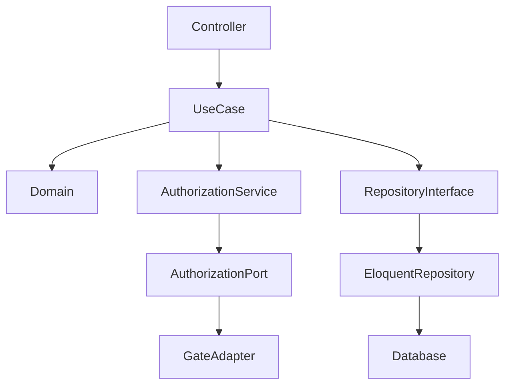

---

# 6. UseCase 処理フロー例

例：書籍登録

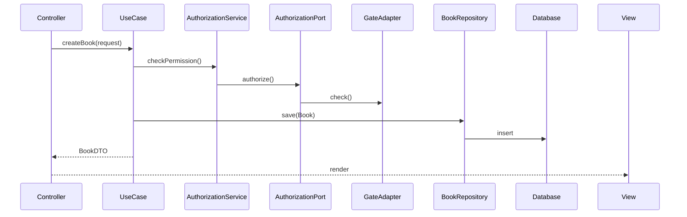

この構造により

- Controllerは薄い
- ビジネスロジックはUseCaseに集約
- フレームワーク依存はInfrastructureに隔離

という構造を実現しています。

---

# 7. 主な機能（Features）

本プロジェクトは書籍管理アプリとして、次の機能を実装しています。

### 書籍管理

- 書籍の登録
- 書籍の編集
- 書籍の削除（Soft Delete）
- 書籍の復元

### カテゴリー管理

- カテゴリーの作成
- カテゴリーの編集
- カテゴリーの削除

### ダッシュボード

- 読書状況サマリー
- 読書中の本
- カテゴリー別冊数
- 削除済みデータ数

### 認可

- ユーザー単位のデータ管理
- 管理者機能
- UseCaseレイヤーでの認可チェック

---

# 8. スクリーンショット

主要な画面の例です。UIの構成や機能のイメージを確認できます。

## 一般機能

主に一般ユーザー向けの機能です。

### ダッシュボード

ダッシュボード画面です。読書状況サマリー、読書中の本、カテゴリー別冊数を確認できます。

<details open>
    <summary style="color: #009689;">スクリーンショット</summary>
    <table>
        <thead>
            <tr>
                <th align="center">PC Layout</th>
                <th align="center">Mobile Layout</th>
            </tr>
        </thead>
        <tbody>
            <tr>
                <td valign="top">
                    <picture>
                        <source media="(prefers-color-scheme: dark)" srcset="./docs/images/preview/dashboard-dark_preview.png">
                        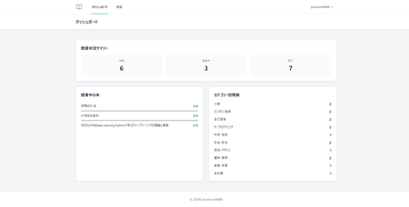
                    </picture>
                    <br>
                    <small>View Full:
                        <a href="./docs/images/dashboard-light.png" target="_blank">Light</a>
                        <a href="./docs/images/dashboard-dark.png" target="_blank">Dark</a>
                    </small>
                </td>
                <td valign="top">
                    <picture>
                        <source media="(prefers-color-scheme: dark)" srcset="./docs/images/preview/dashboard-mobile-dark_preview.png">
                        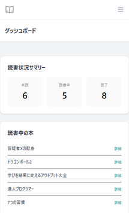
                    </picture>
                    <br>
                    <small>View Full:
                        <a href="./docs/images/dashboard-mobile-light.png" target="_blank">Light</a>
                        <a href="./docs/images/dashboard-mobile-dark.png" target="_blank">Dark</a>
                    </small>
                </td>
            </tr>
        </tbody>
    </table>
</details>

### 書籍一覧

書籍の一覧表示画面です。カテゴリ、削除済み状態、各種操作（編集・削除・復元）を確認できます。

<details open>
    <summary style="color: #009689;">スクリーンショット</summary>
    <table>
        <thead>
            <tr>
                <th align="center">PC Layout</th>
                <th align="center">Mobile Layout</th>
            </tr>
        </thead>
        <tbody>
            <tr>
            <td valign="top">
                <picture>
                    <source media="(prefers-color-scheme: dark)" srcset="./docs/images/preview/books-list-dark_preview.png">
                    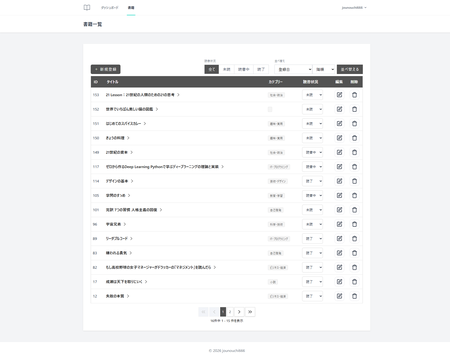
                </picture>
                <br>
                <small>View Full:
                    <a href="./docs/images/books-list-light.png" target="_blank">Light</a>
                    <a href="./docs/images/books-list-dark.png" target="_blank">Dark</a>
                </small>
            </td>
            <td valign="top">
                <picture>
                    <source media="(prefers-color-scheme: dark)" srcset="./docs/images/preview/books-list-mobile-dark_preview.png">
                    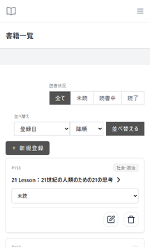
                </picture>
                <br>
                <small>View Full:
                    <a href="./docs/images/books-list-mobile-light.png" target="_blank">Light</a>
                    <a href="./docs/images/books-list-mobile-dark.png" target="_blank">Dark</a>
                </small>
            </td>
            </tr>
        </tbody>
    </table>
</details>

### 書籍登録

新しい書籍を登録する画面です。タイトルやカテゴリーを入力して登録します。

<details open>
    <summary style="color: #009689;">スクリーンショット</summary>
    <table>
        <thead>
            <tr>
                <th align="center">PC Layout</th>
                <th align="center">Mobile Layout</th>
            </tr>
        </thead>
        <tbody>
            <tr>
            <td valign="top">
                <picture>
                    <source media="(prefers-color-scheme: dark)" srcset="./docs/images/preview/books-create-dark_preview.png">
                    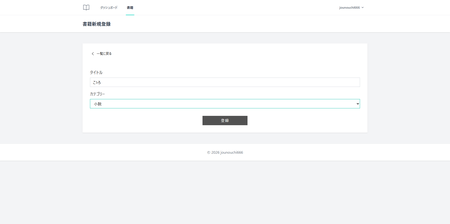
                </picture>
                <br>
                <small>View Full:
                    <a href="./docs/images/books-create-light.png" target="_blank">Light</a>
                    <a href="./docs/images/books-create-dark.png" target="_blank">Dark</a>
                </small>
            </td>
            <td valign="top">
                <picture>
                    <source media="(prefers-color-scheme: dark)" srcset="./docs/images/preview/books-create-mobile-dark_preview.png">
                    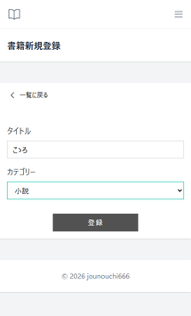
                </picture>
                <br>
                <small>View Full:
                    <a href="./docs/images/books-create-mobile-light.png" target="_blank">Light</a>
                    <a href="./docs/images/books-create-mobile-dark.png" target="_blank">Dark</a>
                </small>
            </td>
            </tr>
        </tbody>
    </table>
</details>

### 書籍詳細表示

書籍の詳細を表示する画面です。

<details open>
    <summary style="color: #009689;">スクリーンショット</summary>
    <table>
        <thead>
            <tr>
                <th align="center">PC Layout</th>
                <th align="center">Mobile Layout</th>
            </tr>
        </thead>
        <tbody>
            <tr>
            <td valign="top">
                <picture>
                    <source media="(prefers-color-scheme: dark)" srcset="./docs/images/preview/books-show-dark_preview.png">
                    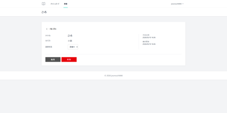
                </picture>
                <br>
                <small>View Full:
                    <a href="./docs/images/books-show-light.png" target="_blank">Light</a>
                    <a href="./docs/images/books-show-dark.png" target="_blank">Dark</a>
                </small>
            </td>
            <td valign="top">
                <picture>
                    <source media="(prefers-color-scheme: dark)" srcset="./docs/images/preview/books-show-mobile-dark_preview.png">
                    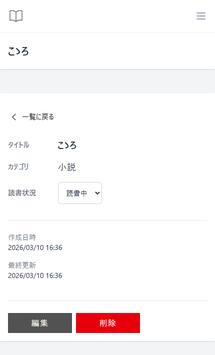
                </picture>
                <br>
                <small>View Full:
                    <a href="./docs/images/books-show-mobile-light.png" target="_blank">Light</a>
                    <a href="./docs/images/books-show-mobile-dark.png" target="_blank">Dark</a>
                </small>
            </td>
            </tr>
        </tbody>
    </table>
</details>

---

## 管理者向け機能

管理者ユーザーのみ表示・操作が可能な機能です。

### カテゴリー管理

カテゴリーの作成・編集・削除を行う管理画面です。

<details open>
    <summary style="color: #009689;">スクリーンショット</summary>
    <table>
        <thead>
            <tr>
                <th align="center">PC Layout</th>
                <th align="center">Mobile Layout</th>
            </tr>
        </thead>
        <tbody>
            <tr>
            <td valign="top">
                <picture>
                    <source media="(prefers-color-scheme: dark)" srcset="./docs/images/preview/categories-list-dark_preview.png">
                    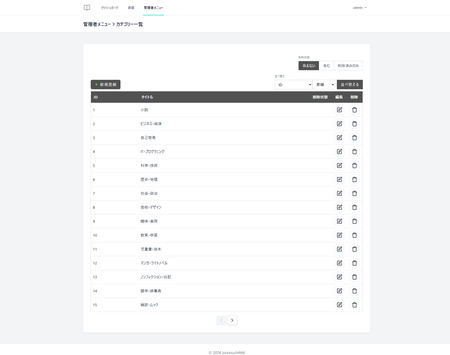
                </picture>
                <br>
                <small>View Full:
                    <a href="./docs/images/categories-list-light.png" target="_blank">Light</a>
                    <a href="./docs/images/categories-list-dark.png" target="_blank">Dark</a>
                </small>
            </td>
            <td valign="top">
                <picture>
                    <source media="(prefers-color-scheme: dark)" srcset="./docs/images/preview/categories-list-mobile-dark_preview.png">
                    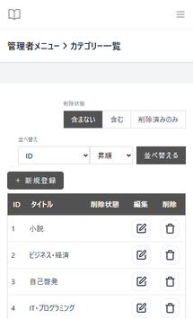
                </picture>
                <br>
                <small>View Full:
                    <a href="./docs/images/categories-list-mobile-light.png" target="_blank">Light</a>
                    <a href="./docs/images/categories-list-mobile-dark.png" target="_blank">Dark</a>
                </small>
            </td>
            </tr>
        </tbody>
    </table>
</details>

### 管理フィルター&カラム

ユーザーや削除状態を指定するフィルターです。
応じて一覧にもカラムが表示されます。

<details open>
    <summary style="color: #009689;">スクリーンショット</summary>
    <table>
        <thead>
            <tr>
                <th align="center">PC Layout</th>
                <th align="center">Mobile Layout</th>
            </tr>
        </thead>
        <tbody>
            <tr>
            <td valign="top">
                <picture>
                    <source media="(prefers-color-scheme: dark)" srcset="./docs/images/preview/books-admin-dark_preview.png">
                    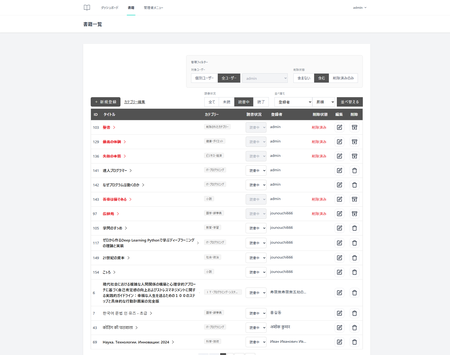
                </picture>
                <br>
                <small>View Full:
                    <a href="./docs/images/books-admin-light.png" target="_blank">Light</a>
                    <a href="./docs/images/books-admin-dark.png" target="_blank">Dark</a>
                </small>
            </td>
            <td valign="top">
                <picture>
                    <source media="(prefers-color-scheme: dark)" srcset="./docs/images/preview/books-admin-mobile-dark_preview.png">
                    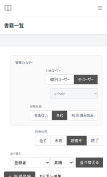
                </picture>
                <br>
                <small>View Full:
                    <a href="./docs/images/books-admin-mobile-light.png" target="_blank">Light</a>
                    <a href="./docs/images/books-admin-mobile-dark.png" target="_blank">Dark</a>
                </small>
            </td>
            </tr>
        </tbody>
    </table>
</details>

### 削除済みデータ管理

Soft Deleteされた書籍を確認し、必要に応じて復元できます。

<details open>
    <summary style="color: #009689;">スクリーンショット</summary>
    <table>
        <thead>
            <tr>
                <th align="center">PC Layout</th>
                <th align="center">Mobile Layout</th>
            </tr>
        </thead>
        <tbody>
            <tr>
            <td valign="top">
                <picture>
                    <source media="(prefers-color-scheme: dark)" srcset="./docs/images/preview/books-restore-dark_preview.png">
                    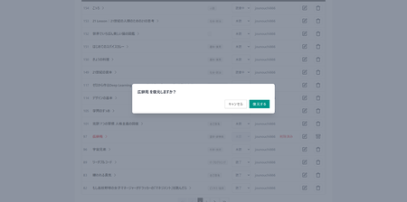
                </picture>
                <br>
                <small>View Full:
                    <a href="./docs/images/books-restore-light.png" target="_blank">Light</a>
                    <a href="./docs/images/books-restore-dark.png" target="_blank">Dark</a>
                </small>
            </td>
            <td valign="top">
                <picture>
                    <source media="(prefers-color-scheme: dark)" srcset="./docs/images/preview/books-restore-mobile-dark_preview.png">
                    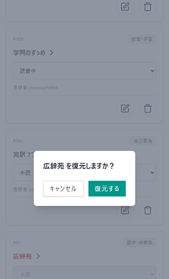
                </picture>
                <br>
                <small>View Full:
                    <a href="./docs/images/books-restore-mobile-light.png" target="_blank">Light</a>
                    <a href="./docs/images/books-restore-mobile-dark.png" target="_blank">Dark</a>
                </small>
            </td>
            </tr>
        </tbody>
    </table>
</details>

また、ダッシュボードにも削除済み件数が表示されます。

<details open>
    <summary style="color: #009689;">スクリーンショット</summary>
    <table>
        <thead>
            <tr>
                <th align="center">PC Layout</th>
                <th align="center">Mobile Layout</th>
            </tr>
        </thead>
        <tbody>
            <tr>
                <td valign="top">
                    <picture>
                        <source media="(prefers-color-scheme: dark)" srcset="./docs/images/preview/dashboard-deleted-dark_preview.png">
                        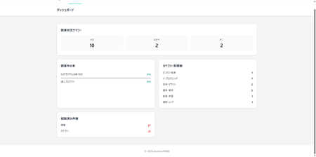
                    </picture>
                    <br>
                    <small>View Full:
                        <a href="./docs/images/dashboard-deleted-light.png" target="_blank">Light</a>
                        <a href="./docs/images/dashboard-deleted-dark.png" target="_blank">Dark</a>
                    </small>
                </td>
                <td valign="top">
                    <picture>
                        <source media="(prefers-color-scheme: dark)" srcset="./docs/images/preview/dashboard-deleted-mobile-dark_preview.png">
                        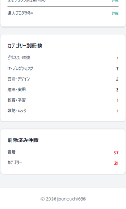
                    </picture>
                    <br>
                    <small>View Full:
                        <a href="./docs/images/dashboard-deleted-mobile-light.png" target="_blank">Light</a>
                        <a href="./docs/images/dashboard-deleted-mobile-dark.png" target="_blank">Dark</a>
                    </small>
                </td>
            </tr>
        </tbody>
    </table>
</details>

---

# 9. ER図

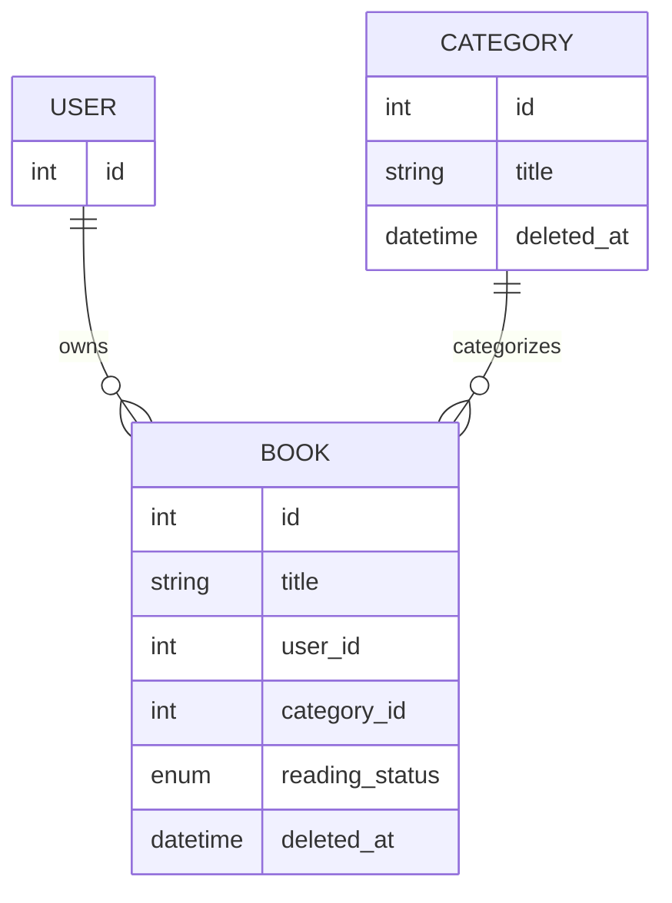

---

# 10. セットアップ

```
git clone https://github.com/jounouchi666/books_app_laravel

cd books_app_laravel

composer install
npm install

./vendor/bin/sail up -d

./vendor/bin/sail artisan migrate

# フロントエンドビルド
./vendor/bin/sail npm run dev
```

起動後

```
http://localhost
```

---

# 11. 今後の展望

今後は以下の改善を検討しています。

- Domain Eventsの導入
- CQRSによるReadモデル最適化
- APIレイヤー

---

# License

MIT